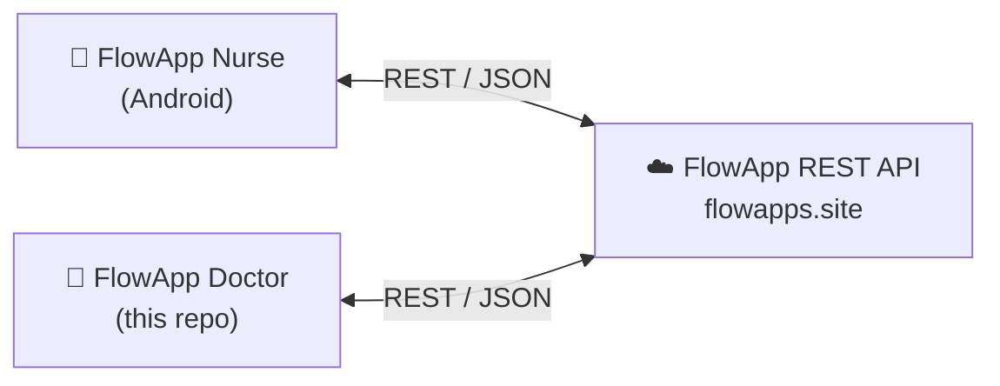

# FlowApp Doctor Android Application

A native Android application built for physicians to manage patient inquiries, approve treatments, and monitor clinical workflows.

## Overview

This app is the doctor's portal for the FlowApp hospital system. It enables doctors to review patient data, respond to medical inquiries, and authorize clinical procedures and treatments directly from their mobile device.

## Part of the FlowApp Ecosystem

FlowApp is a two-sided hospital workflow system. This repository contains the **doctor-facing** app; nurses use a companion app, and both communicate with the same central REST API.

- 🩺 **FlowApp Doctor** — this repository
- 💉 **[FlowApp Nurse](https://github.com/ilaydasahin/FlowAppNurse)** — companion app for nursing staff (digital health cards, treatments, announcements)
- ☁️ **FlowApp REST API** — central backend consumed by both apps (private)

## Features

- Physician Dashboard: Overview of assigned patients and pending actions.
- Inquiry System ("Sorma" — consult requests): Review and respond to patient or nurse queries.
- Treatment Approval: Authorize procedures (e.g., vaccines, medications).
- Real-Time Sync: Communicates with central hospital REST API.

## Technology Stack

- Platform: Android, 100% Java (minSdk 24, targetSdk 34)
- Architecture: MVC — Activity/Fragment-based UI with RecyclerView adapters
- Networking: Retrofit2 + Gson converter
- UI: XML layouts, Material Design components, CardView
- Images: Picasso

## Build Instructions

1. Open project in Android Studio.
2. Sync project with Gradle files.
3. Run on an Android device or emulator (API Level 24+).

## License

This project is licensed under the [MIT License](LICENSE).
